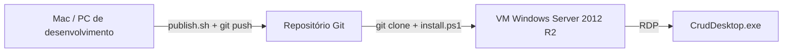

# CrudDesktop — Exemplo de Aplicação Legada

Aplicação desktop de CRUD (Create, Read, Update, Delete) desenvolvida propositalmente como **exemplo de software legado** rodando em um **sistema operacional antigo**.

O cenário-alvo é uma **VM Windows Server 2012 R2** hospedada em **OpenShift Virtualization** (KubeVirt). O objetivo é demonstrar como uma aplicação .NET clássica — WinForms + .NET Framework 4.5 — pode ser desenvolvida, publicada e instalada nesse ambiente, respeitando as limitações de plataformas que não suportam runtimes modernos (.NET 6+).

---

## Sobre o projeto

| Aspecto | Detalhe |
|---------|---------|
| **Tipo** | Aplicação desktop WinForms |
| **Runtime** | .NET Framework 4.5 (`net45`) |
| **SO alvo** | Windows Server 2012 R2 |
| **Persistência** | Arquivo JSON local (sem banco de dados) |
| **Domínio** | Cadastro simples de contatos (Nome, E-mail, Telefone) |

### Por que .NET Framework 4.5?

O Windows Server 2012 R2 já inclui o .NET Framework 4.5 (ou superior via Windows Update). Versões modernas do .NET (**6, 7, 8+**) **não são suportadas** nesse sistema operacional. Usar `net45` garante que a aplicação rode **sem instalar runtimes adicionais** na VM.

### O que a aplicação faz?

- Lista contatos em uma grade (DataGridView)
- Permite **criar**, **editar** e **excluir** registros
- Salva os dados automaticamente em:

  ```
  C:\Users\<usuario>\AppData\Local\CrudDesktop\contatos.json
  ```

---

## Arquitetura do fluxo de deploy



A VM **não precisa compilar** o código. Os binários são gerados na máquina de desenvolvimento, commitados em `publish/net45/` e instalados na VM via scripts PowerShell.

---

## Estrutura do repositório

```
dotnet4-app-desktop/
├── CrudDesktop.sln
├── CrudDesktop/
│   ├── Models/Contato.cs              # Entidade
│   ├── Services/ContatoRepository.cs  # Persistência JSON
│   ├── Forms/ContatoForm.cs           # Formulário de cadastro
│   ├── MainForm.cs                    # Tela principal
│   └── Program.cs                     # Ponto de entrada
├── publish/net45/                     # Binários prontos para a VM
│   ├── CrudDesktop.exe
│   ├── CrudDesktop.exe.config
│   └── Newtonsoft.Json.dll
└── scripts/
    ├── publish.sh / publish.ps1       # Gera publish/net45/ (dev)
    ├── install.ps1                    # Instala/atualiza na VM
    ├── install-git.ps1                # Instala Git na VM
    └── clone-and-install.ps1          # Clone + install em um passo
```

---

## Passo a passo completo

### Parte 1 — Desenvolvimento (Mac ou PC moderno)

#### 1.1 Pré-requisitos

- [.NET SDK 6+](https://dotnet.microsoft.com/download) (para compilar projetos `net45` via MSBuild)
- Git

#### 1.2 Clonar o repositório

```bash
git clone https://github.com/SEU-USUARIO/dotnet4-app-desktop.git
cd dotnet4-app-desktop
```

#### 1.3 Compilar e testar localmente (opcional)

```bash
cd CrudDesktop
dotnet restore
dotnet build -c Release
```

> No Mac/Linux o executável WinForms é gerado, mas só roda em Windows.

#### 1.4 Publicar binários para a VM

```bash
./scripts/publish.sh
```

Isso copia os arquivos necessários para `publish/net45/`:

- `CrudDesktop.exe`
- `CrudDesktop.exe.config`
- `Newtonsoft.Json.dll`

#### 1.5 Enviar para o Git

```bash
git add publish/net45 scripts/
git commit -m "Publica binarios para deploy na VM"
git push
```

---

### Parte 2 — Preparar a VM (Windows Server 2012 R2)

#### 2.1 Requisitos da VM

| Item | Obrigatório? | Observação |
|------|:------------:|------------|
| Interface gráfica (GUI) | Sim | WinForms não roda em Server Core |
| .NET Framework 4.5+ | Sim | Já incluso no Server 2012 R2 |
| RDP habilitado | Sim | Para usar a aplicação interativamente |
| Git for Windows | Sim | Para clonar o repositório |
| .NET SDK / Visual Studio | Não | Binários vêm prontos em `publish/net45/` |

#### 2.2 Verificar .NET Framework na VM

Abra **PowerShell** e execute:

```powershell
Get-ChildItem 'HKLM:\SOFTWARE\Microsoft\NET Framework Setup\NDP\v4\Full\' |
  Get-ItemProperty |
  Select-Object Version, Release
```

| Release | Versão |
|---------|--------|
| 378389 | 4.5 |
| 378675 | 4.5.1 |
| 379893 | 4.5.2 |
| 393295+ | 4.6+ |

Qualquer Release **≥ 378389** é suficiente.

#### 2.3 Conectar na VM

Via **OpenShift Virtualization**, acesse a VM por RDP:

```bash
# No cluster OpenShift — descobrir a VM
oc get vm -n <seu-namespace>

# Console (troubleshooting)
virtctl console <nome-da-vm> -n <seu-namespace>
```

No cliente Windows/Mac:

```
mstsc /v:<IP-da-VM>:3389
```

#### 2.4 Instalar Git via PowerShell

O Server 2012 R2 não inclui Git. Instale via PowerShell **como Administrador**:

```powershell
Set-ExecutionPolicy RemoteSigned -Scope CurrentUser -Force

# Habilitar TLS 1.2 (necessario no Server 2012 R2)
[Net.ServicePointManager]::SecurityProtocol = [Net.SecurityProtocolType]::Tls12

$installer = "$env:TEMP\Git-2.47.1-64-bit.exe"
$url = "https://github.com/git-for-windows/git/releases/download/v2.47.1.windows.1/Git-2.47.1-64-bit.exe"

Write-Host "Baixando Git..."
(New-Object System.Net.WebClient).DownloadFile($url, $installer)

Write-Host "Instalando Git..."
Start-Process -FilePath $installer -ArgumentList '/VERYSILENT','/NORESTART','/NOCancel','/SP-' -Wait

# Atualizar PATH nesta sessao
$env:Path = "C:\Program Files\Git\bin;C:\Program Files\Git\cmd;" + $env:Path

git --version
```

**Alternativa offline:** baixe o instalador no Mac, copie para a VM via RDP e execute:

```powershell
Start-Process -FilePath 'C:\Temp\Git-2.47.1-64-bit.exe' -ArgumentList '/VERYSILENT','/NORESTART' -Wait
```

Se o repositório já estiver clonado na VM, use o script pronto:

```powershell
.\scripts\install-git.ps1
```

Feche e abra um **novo PowerShell** após a instalação.

---

### Parte 3 — Instalar a aplicação na VM

#### 3.1 Clone + instalação (recomendado)

```powershell
Set-ExecutionPolicy RemoteSigned -Scope CurrentUser

git clone https://github.com/SEU-USUARIO/dotnet4-app-desktop.git C:\src\dotnet4-app-desktop
cd C:\src\dotnet4-app-desktop
.\scripts\install.ps1 -CreateShortcut
```

O script:

1. Faz `git pull` (se o repositório já existir)
2. Usa os binários de `publish/net45/` (ou compila, se houver ferramentas de build)
3. Copia os arquivos para `C:\Apps\CrudDesktop`
4. Cria atalho na área de trabalho (com `-CreateShortcut`)

#### 3.2 Instalação em um único comando

```powershell
Set-ExecutionPolicy RemoteSigned -Scope CurrentUser

Invoke-WebRequest `
  -Uri 'https://raw.githubusercontent.com/SEU-USUARIO/dotnet4-app-desktop/main/scripts/clone-and-install.ps1' `
  -OutFile "$env:TEMP\clone-and-install.ps1"

& "$env:TEMP\clone-and-install.ps1" `
  -RepoUrl 'https://github.com/SEU-USUARIO/dotnet4-app-desktop.git' `
  -CreateShortcut
```

#### 3.3 Executar a aplicação

```powershell
C:\Apps\CrudDesktop\CrudDesktop.exe
```

Ou clique no atalho **CrudDesktop** na área de trabalho.

---

### Parte 4 — Atualizar a aplicação

#### No Mac/PC de desenvolvimento

Após alterar o código:

```bash
./scripts/publish.sh
git add publish/net45
git commit -m "Atualiza binarios"
git push
```

#### Na VM

```powershell
cd C:\src\dotnet4-app-desktop
.\scripts\install.ps1 -CreateShortcut
```

---

## Repositório privado

Para GitHub ou GitLab privado, configure credenciais antes do clone:

```powershell
git config --global credential.helper wincred
git clone https://github.com/SEU-USUARIO/dotnet4-app-desktop.git
```

Use **usuário + Personal Access Token** (não a senha da conta) quando solicitado.

---

## Compilar na VM (opcional, não recomendado)

O .NET SDK 6+ **não instala** no Windows Server 2012 R2. Compilar na VM exige [Visual Studio 2019 Build Tools](https://visualstudio.microsoft.com/downloads/) (~GB de download).

Se optar por esse caminho:

```powershell
.\scripts\install.ps1 -ForceBuild -CreateShortcut
```

O fluxo recomendado para ambientes legados é sempre **compilar fora e publicar binários no Git**.

---

## Solução de problemas

| Problema | Causa | Solução |
|----------|-------|---------|
| `Split-Path : Path is null` no `install.ps1` | Bug do PowerShell 4.0 no Server 2012 R2 | Faça `git pull` — já corrigido para usar `$PSScriptRoot` |
| Download do Git falha | TLS antigo no Server 2012 R2 | Habilite TLS 1.2 ou use instalador offline via RDP |
| App não abre | VM sem GUI (Server Core) | Use edição com interface gráfica + sessão RDP |
| `Newtonsoft.Json.dll` não encontrado | Pacote incompleto | Copie os 3 arquivos de `publish/net45/` juntos |
| "Precisa de .NET Framework" | Runtime ausente ou versão antiga | Verifique Release ≥ 378389 (seção 2.2) |
| Dados não aparecem para outro usuário | JSON é por perfil | Cada usuário tem seu `%LocalAppData%\CrudDesktop\` |

### Habilitar TLS 1.2 (se downloads falharem)

Execute como Administrador e reinicie o PowerShell:

```powershell
New-Item -Path 'HKLM:\SYSTEM\CurrentControlSet\Control\SecurityProviders\SCHANNEL\Protocols\TLS 1.2\Client' -Force
New-ItemProperty -Path 'HKLM:\SYSTEM\CurrentControlSet\Control\SecurityProviders\SCHANNEL\Protocols\TLS 1.2\Client' -Name 'Enabled' -Value 1 -PropertyType DWord -Force
New-ItemProperty -Path 'HKLM:\SYSTEM\CurrentControlSet\Control\SecurityProviders\SCHANNEL\Protocols\TLS 1.2\Client' -Name 'DisabledByDefault' -Value 0 -PropertyType DWord -Force
```

---

## Resumo do fluxo

```
[Mac/PC]  ./scripts/publish.sh  →  git push
                ↓
[Git]     publish/net45/ com binarios
                ↓
[VM]      git clone  →  .\scripts\install.ps1  →  C:\Apps\CrudDesktop\
                ↓
[RDP]     CrudDesktop.exe
```

---

## Licença

Projeto de exemplo para demonstração de aplicações legadas em ambientes virtualizados.
